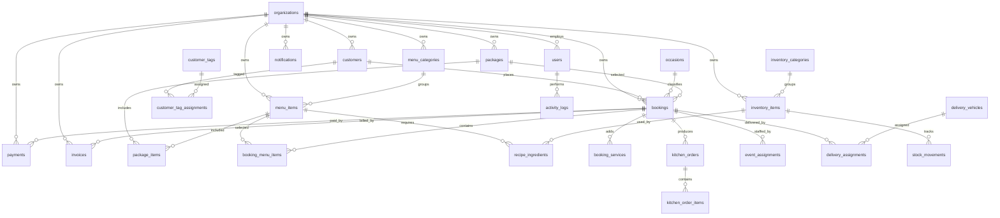

# Database ER Diagram

```mermaid
erDiagram
    organizations ||--o{ users : employs
    organizations ||--o{ customers : owns
    organizations ||--o{ menu_categories : owns
    organizations ||--o{ menu_items : owns
    organizations ||--o{ packages : owns
    organizations ||--o{ bookings : owns
    organizations ||--o{ inventory_items : owns
    organizations ||--o{ payments : owns
    organizations ||--o{ invoices : owns
    organizations ||--o{ notifications : owns

    customers ||--o{ bookings : places
    customers ||--o{ customer_tag_assignments : tagged
    customer_tags ||--o{ customer_tag_assignments : assigned

    menu_categories ||--o{ menu_items : groups
    packages ||--o{ package_items : includes
    menu_items ||--o{ package_items : included
    menu_items ||--o{ booking_menu_items : selected
    menu_items ||--o{ recipe_ingredients : requires

    occasions ||--o{ bookings : classifies
    packages ||--o{ bookings : selected
    bookings ||--o{ booking_menu_items : contains
    bookings ||--o{ booking_services : adds
    bookings ||--o{ payments : paid_by
    bookings ||--o{ invoices : billed_by
    bookings ||--o{ kitchen_orders : produces
    bookings ||--o{ event_assignments : staffed_by
    bookings ||--o{ delivery_assignments : delivered_by

    kitchen_orders ||--o{ kitchen_order_items : contains
    inventory_categories ||--o{ inventory_items : groups
    inventory_items ||--o{ stock_movements : tracks
    inventory_items ||--o{ recipe_ingredients : used_by
    delivery_vehicles ||--o{ delivery_assignments : assigned
    users ||--o{ activity_logs : performs
```
