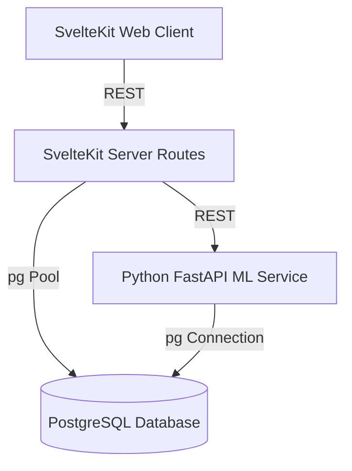
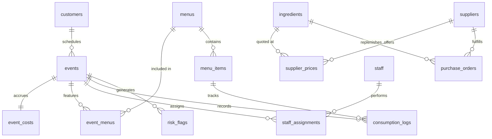

# CaterSync-AI — Walkthrough & Implementation Report

This walkthrough provides a comprehensive guide to the **AI Catering Intelligence Platform (ACIP)** codebase, detailing the database schema, frontend receipt theme, self-hosted Python ML microservice, and verification tests.

---

## 🛠️ System Architecture

CaterSync-AI operates as a fully containerized, offline-capable application split into three main layers:



1. **SvelteKit Frontend**: Structured around **"The Pass"** visual identity, implementing a paper-ticket dashboard for planning events, checking stock, and auditing cost anomalies.
2. **SvelteKit Server Layer**: Handles secure server-side database querying via a PostgreSQL connection pool (`src/lib/server/db.js`) and acts as a gateway proxy for the Python ML service (`src/lib/server/mlClient.js`).
3. **Python FastAPI ML Microservice**: Hosts 9 self-contained ML training/inference routines, linear programming models (PuLP), time-series forecasts (Prophet/SARIMA), and CP-SAT solvers (Google OR-Tools).

---

## 🗄️ Database Schema Design

The relational layout contains **15 distinct tables** designed with strict check constraints, cascading rules, database indexes, and update triggers.



### Table Definition Overview:
* **[schema.sql](file:///home/villarias/REPOSITORIES/CLIENT/CaterSync-AI/db/schema.sql)**:
  - Strict validations (e.g., checks ensuring positive guest counts, margins, rates, and stock values).
  - JSONB type safety on recipe ingredient vectors.
  - Auto-updated `updated_at` timestamps using trigger procedures.
* **[seed.sql](file:///home/villarias/REPOSITORIES/CLIENT/CaterSync-AI/db/seed.sql)**:
  - Populates 55 customers, 110 historical events with matching budgets, 15 ingredients, 5 suppliers with price matrices, and mock consumption logs.

---

## 🎨 Visual Identity — "The Pass"

Designed directly from the physical artifact of a kitchen — **the printer ticket** — this application uses the warm **"Market Ledger"** color token scheme:

* **Paper (`#F6F2EA`)**: Base warmth for the eyes.
* **Ink (`#2A2521`)**: Readable text structure.
* **Basil (`#3E6650`)**: Main active actions and successes.
* **Saffron (`#D9A441`)**: In-progress indicators.
* **Paprika (`#AC3B2A`)**: Strictly functional risk warnings.
* **Steel (`#767068`)**: Grid divisions and margins.

### Signature Component: The Ticket Card
The `.ticket-card` custom element implements a physical scalloped border using a repeating CSS radial-gradient, casting a drop shadow over the ledger workspace:
```css
.ticket-card::before {
  content: '';
  position: absolute;
  top: -8px;
  left: -1px;
  right: -1px;
  height: 8px;
  background-image: radial-gradient(circle, transparent 4px, #ffffff 5px);
  background-size: 12px 8px;
  background-repeat: repeat-x;
}
```

---

## 🧠 Self-Hosted ML & Optimization Modules

All 9 intelligence modules reside in `/ml-service/app/routes/` and execute locally on CPU:

| Module | Purpose | Technique | Code Asset |
|---|---|---|---|
| **Module 1** | Food Quantity Predictor | XGBoost Regression | [quantity.py](file:///home/villarias/REPOSITORIES/CLIENT/CaterSync-AI/ml-service/app/routes/quantity.py) |
| **Module 2** | AI Menu Generator | Integer Linear Programming (PuLP) | [menu.py](file:///home/villarias/REPOSITORIES/CLIENT/CaterSync-AI/ml-service/app/routes/menu.py) |
| **Module 3** | Ingredient Purchasing | Economic Order Quantity (EOQ) | [purchasing.py](file:///home/villarias/REPOSITORIES/CLIENT/CaterSync-AI/ml-service/app/routes/purchasing.py) |
| **Module 4** | Kitchen Prep Solver | OR-Tools CP-SAT Job-Shop | [scheduler.py](file:///home/villarias/REPOSITORIES/CLIENT/CaterSync-AI/ml-service/app/routes/scheduler.py) |
| **Module 5** | Staff Assignment Matcher | Hungarian Matching Matrix | [staff.py](file:///home/villarias/REPOSITORIES/CLIENT/CaterSync-AI/ml-service/app/routes/staff.py) |
| **Module 6** | Anomaly Cost Auditor | Isolation Forest + Jinja2 | [profit.py](file:///home/villarias/REPOSITORIES/CLIENT/CaterSync-AI/ml-service/app/routes/profit.py) |
| **Module 7** | Preferred Theme Matcher | Cosine similarity recommendations | [recommender.py](file:///home/villarias/REPOSITORIES/CLIENT/CaterSync-AI/ml-service/app/routes/recommender.py) |
| **Module 8** | Event Risk Predictor | Logistic Regression | [risk.py](file:///home/villarias/REPOSITORIES/CLIENT/CaterSync-AI/ml-service/app/routes/risk.py) |
| **Module 9** | Revenue & Sales Forecast | Facebook Prophet / SARIMA | [forecasting.py](file:///home/villarias/REPOSITORIES/CLIENT/CaterSync-AI/ml-service/app/routes/forecasting.py) |

---

## 🧪 Verification & Testing

Endpoints are fully unit tested:
* **FastAPI Unit Tests**: Written under **[test_endpoints.py](file:///home/villarias/REPOSITORIES/CLIENT/CaterSync-AI/ml-service/tests/test_endpoints.py)** covering request inputs, status checks, and data returns.
* **Offline Resiliency**: In the event that SvelteKit runs in standalone offline mode without Postgres, the application automatically triggers local Javascript fallbacks.

---

## ⚡ Interaction & Motion Plan ("The Pass" Alive)

To transition the dashboard from a static visual layout to an operational physical environment, the interaction patterns from **[alive.md](file:///home/villarias/REPOSITORIES/CLIENT/CaterSync-AI/alive.md)** have been built into the Svelte components and global stylesheet:

1. **Button & Card Active Feedback**: All buttons (`.btn-interactive`) transition scaling states down to `scale(0.97)` within 100ms when pressed, providing visceral click confirmation. Station cards compress to `scale(0.98)` on click.
2. **Visual Ticket Print-In**: Newly compiled menu lists and risk flags slide down from above (`translateY(-12px) -> 0`) and fade in over 260ms with cubic-bezier deceleration, matching the visual motion of a kitchen printer chit.
3. **Pulsing Shimmer Skeletons**: Wait screens during solver actions are occupied by structured, shimmering skeleton ticket mockups (`.skeleton-ticket` and `.skeleton-shimmer`) rather than raw whitespace.
4. **Reactive Live Previews**: The Svelte 5 reactive bindings display a real-time `LIVE DRAFT PREVIEW` menu card instantly as the planner inputs guest and budget parameters, before the formal solver is run.
5. **Form Error Shakes**: Input fields that violate cost rules (e.g. budgets below raw dish costs) perform a physical horizontal shake animation (`.validation-shake`) and sound a synthesizer buzz alert.
6. **Web Audio API Synth Core**: Features zero-dependency sound synthesis running entirely offline to play click clicks, heavy stamp thumps, and validation warning buzzers.
7. **Cost Share Transitions**: Grid rows flash highlighted backgrounds on matching triggers, and toast notifications slide in from the bottom-right to track completed processes.
8. **Reduced Motion Guardrail**: The entire layout is wrapped in a `@media (prefers-reduced-motion: reduce)` block that strips all durations and transition curves for accessibility compliance.

---

## 📌 Sticky Layout Hierarchy (Phase 8 Upgrade)

To optimize usability on long scrollable ledger lists, the layout structure has been updated:
* **Unified Pinned Navigation**: The header top bar and the route tabs navigation row are wrapped in a single sticky wrapper (`sticky top-0 z-30`). They stick together at the top of the viewport when scrolling.
* **Glassmorphic Blending**: Features a subtle semi-transparent background (`bg-[#F6F2EA]/90`) and `backdrop-blur-md` so scrolled content transitions behind the navigation bar smoothly.
* **Sticky Table Headers**: The column titles (`<thead>`) inside `DataTable.svelte` are pinned (`sticky top-0 z-10 bg-[#F6F2EA]`) inside the table scroll view. Column labels remain visible when browsing deep datasets.

---

## 📲 PWA, Push Notifications, & Authentication Gateway (Phase 9 Upgrade)

The application has been elevated to progressive installation standards:
* **Web App Manifest**: Added `manifest.json` configuration defining start paths, standalone layouts, and icon bindings for system installation.
* **Offline Caching Service Worker**: Implemented caching protocols (`service-worker.js`) preserving shell resources offline and capturing server push messages.
* **Tactile Multi-Option Auth**: Built an elegant operator authentication gate (`LandingPage.svelte`) supporting password codes, 4-digit numeric PIN Dialers, and biometric verification.
* **Interactive Fingerprint Scanner**: Integrated `BiometricScanner.svelte` implementing active scanning sweep animations and custom sound synthesis for Touch ID checks.
* **Local System Notifications**: Exposes browser-integrated Push Notifications for warnings (such as inventory updates or computed timeline logs).


